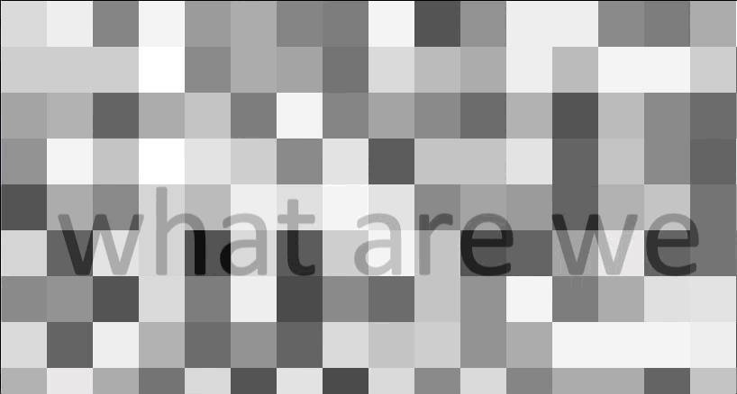

# Static Motion

Testing out constant, randomly-updating background image, and interaction by tracking the mouse location and whether or not it's being clicked.  

## Purpose
Demonstrating random greyscale generation to mimic static, and using interactive mouse motion while changing images based on selection.
